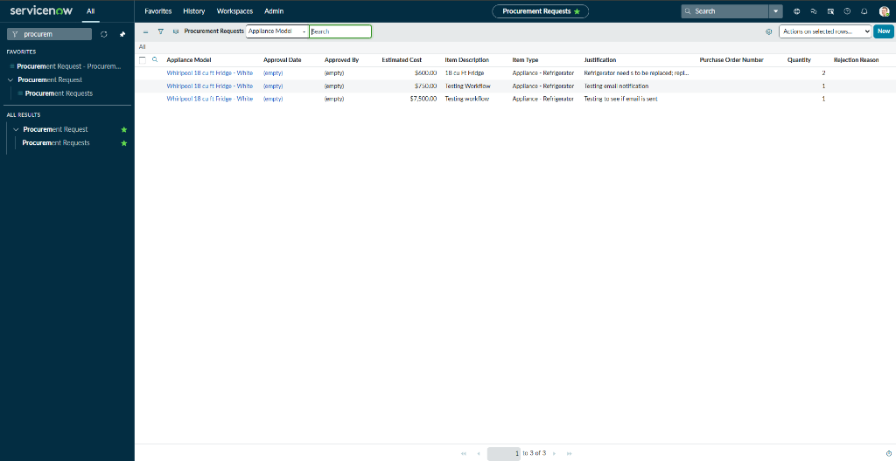
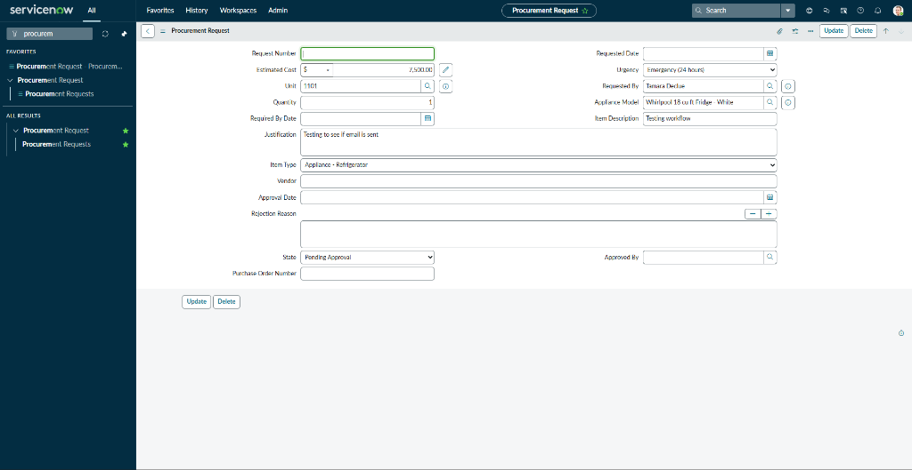
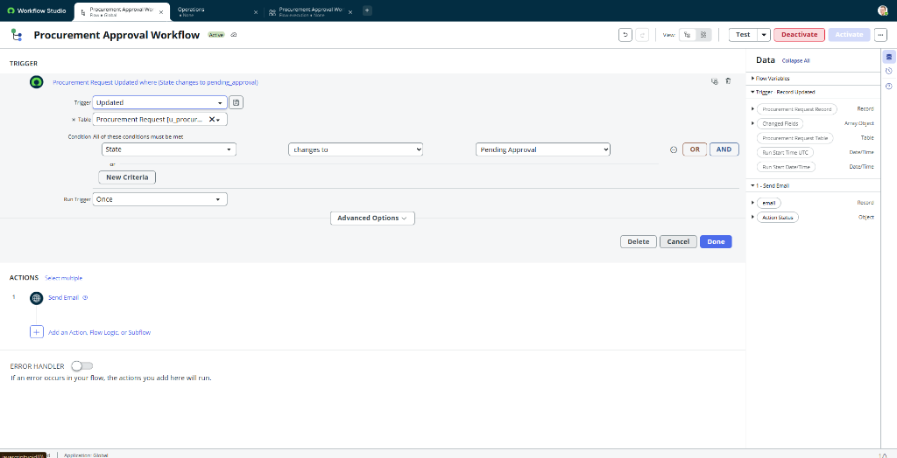
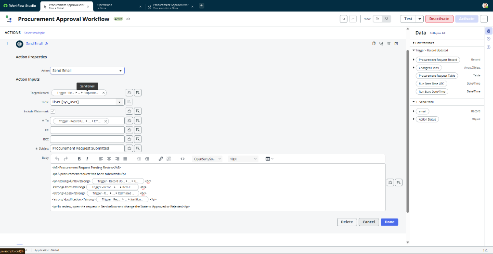
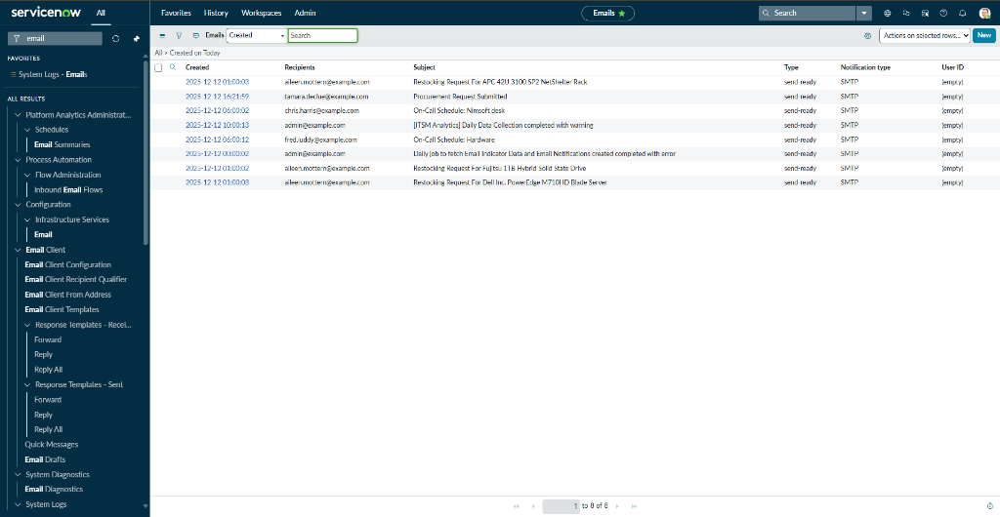

# Procurement Workflow Automation

Designed and delivered a procurement workflow application to enforce budget controls and prevent unauthorized spending. Automated multi-tier approvals based on purchase amount, integrated with asset inventory to prevent duplicate orders, and provided complete audit trail for compliance.

**Business Value:** Enforces mandatory approvals, eliminates duplicate purchasing, reduces manual approval routing, and provides compliance audit trail.

---

## Business Problem

**Before:**
- Unauthorized spending due to lack of approval gates
- Duplicate purchasing - no inventory visibility during ordering process
- Manual approval routing created delays for critical repairs
- No audit trail for compliance or budget tracking

---

## Solution Delivered

**Custom Procurement Application:**
- Created procurement request table with approval tracking
- Implemented Flow Designer workflow with 3-tier approval logic:
  - Under $500: Auto-approved
  - $500-$1,999: Supervisor approval required
  - $2,000+: Dual approval (Supervisor + Property Manager)
- Integrated with Asset Management tables for real-time inventory lookup
- Built email notifications for approval requests and status updates
- Configured complete audit trail (requester, approvers, dates, rejection reasons)

---

## Business Value

**What the System Does:**
- **Enforces budget controls** through mandatory approval gates based on dollar thresholds
- **Prevents duplicate purchasing** by querying asset inventory before approval
- **Reduces approval cycle time** through automated workflow routing (no manual forwarding)
- **Provides audit compliance** with complete digital trail of all spending decisions
- **Enables data-driven budgeting** through procurement reporting by category

---

## Technical Highlights

**ServiceNow Features Used:**
- **Flow Designer:** Conditional approval routing with dollar-threshold logic
- **Business Rules:** Auto-calculate approval tier based on estimated cost
- **Email Notifications:** Branded approval request templates
- **GlideRecord API:** Inventory lookup queries to prevent duplicate orders
- **Reference Fields:** Integration with Asset Management (`u_appliance`, `u_appliance_model` tables)
- **Service Catalog:** Self-service procurement request form (optional)

**Code Example - Business Rule:**
```javascript
// Auto-calculate approval requirements based on purchase amount
(function executeRule(current, previous) {
    var totalCost = parseFloat(current.estimated_cost) || 0;
    
    if (totalCost < 500) {
        current.approval_required = false;
        current.state = 'approved';
    } else if (totalCost >= 500 && totalCost < 2000) {
        current.approval_tier = 'supervisor';
    } else {
        current.approval_tier = 'dual';
    }
})(current, previous);
```

---

## Screenshots

### Procurement Requests List
  
*Dashboard showing pending, approved, and rejected purchase requests with status tracking*

### Procurement Request Form
  
*Self-service form with auto-calculated approval tier and budget code categorization*

### Flow Designer Approval Logic
  
*Multi-tier approval workflow showing conditional branching based on dollar thresholds*

### Email Notification Template
  
*Branded approval request email with embedded request details*

### Email Delivery Proof
  
*System log confirming successful email delivery to approver*

---

## Setup Notes

**Environment:** ServiceNow Personal Developer Instance (Zurich Release)

**Prerequisites:**
- Asset Management tables (from related portfolio project)
- Email configuration enabled
- Flow Designer access

**Key Tables:**
- `u_procurement_request` (custom table - extends Task)
- Integration: `u_appliance_model`, `u_appliance` (inventory lookup)

---

## Technologies

- ServiceNow Flow Designer
- Business Rules (Server-side JavaScript)
- GlideRecord API
- Email Notifications
- Service Catalog
- Reference Fields

---

## Related Projects

Integrates with [Asset & NSPIRE Compliance Application](../project1_asset_compliance) for inventory lookup functionality.

---

**Built on ServiceNow Platform (Zurich Release)**
